# 🚚 배포 가이드 — 나눠 쓰는 방법

> **현재 상태 (2026-08-16 확인)**
>
> | 항목 | 값 |
> |---|---|
> | 서비스 주소 | **https://legoschool.github.io/pkems-googlenote/** |
> | 저장소 | `legoschool/pkems-googlenote` (Public) |
> | 배포 | GitHub Pages · `main` 푸시 시 자동 |
> | 구글 프로젝트 | 번호 `255330405723` (Gemini API) |
> | 게시 상태 | **프로덕션 · 외부 · 미검증** |
> | 사용 인원 | **100명 중 1명 사용** |
>
> **지금은 링크만 주면 됩니다.** 받는 사람을 미리 등록할 필요가 없습니다.

---

## 이 앱은 서버가 없습니다

각 사용자의 브라우저가 **자기 구글 계정**으로 **자기 드라이브**에 직접 저장합니다.
배포하는 사람은 서버 비용도, 저장 공간도, 남의 데이터 관리 책임도 지지 않습니다.
데이터가 배포자를 거치지 않으므로 **배포자는 남의 기록을 볼 수 없습니다.**

---

# 🅐 지금 방식 — 링크만 주기 (100명까지)

## 받는 사람이 하는 일

1. 링크를 엽니다
2. **[구글 로그인]** → 계정 선택
3. **"Google에서 확인하지 않은 앱"** 화면이 나옵니다
   → 왼쪽 아래 **[고급]** → **[구글 기록장(으)로 이동]**
   *(개인·학교가 만든 앱은 모두 이 화면이 나옵니다. 정상입니다.)*
4. 드라이브 권한 **[허용]**
5. 드라이브에 폴더를 하나 만들고, 그 폴더를 연 상태의 **주소를 복사**
6. 앱에서 **[⚙️ 설정]** → 폴더 칸에 붙여넣고 **[이 폴더로 연결]**

끝입니다. 그다음부터는 쓰기만 하면 자동으로 올라갑니다.

> 📨 그대로 복사해 보낼 안내문은 **[사용안내.md](사용안내.md)** 에 있습니다.

## 배포자가 하는 일

**없습니다.** 링크만 주면 됩니다.

다만 두 가지는 알고 계셔야 합니다.

### ⚠️ 100명은 평생 한도이고 되돌릴 수 없습니다

이 앱은 사용자가 폴더 주소를 직접 지정하기 때문에 `.../auth/drive`(제한된 범위) 권한을 씁니다.
구글은 심사받지 않은 앱에 **프로젝트 전 기간 통틀어 100명**의 한도를 겁니다.
한 번 소진된 자리는 **재설정되지 않습니다.**

현재 사용량은 여기서 확인합니다 →
[인증 플랫폼 → 대상](https://console.cloud.google.com/auth/audience?project=gen-lang-client-0016801991)

### ⚠️ 「테스트로 돌아가기」를 누르지 마세요

지금은 프로덕션이라 **아무나 로그인할 수 있는 상태**입니다.
테스트로 되돌리면 **등록한 사람만** 쓸 수 있게 바뀌어서 오히려 불편해집니다.
(이미 소진된 100명 한도도 돌아오지 않습니다.)

---

# 🅑 100명이 찼을 때 — 사본 떠서 각자 배포

받는 사람이 **자기 앱**을 갖는 방식입니다. 사본마다 100명이 새로 생깁니다.
아래는 **사본을 가져가는 사람**이 하는 일입니다. 처음이면 15분쯤 걸립니다.

> 각 단계마다 **「화면에 이렇게 보입니다 → 이걸 누르세요」** 로 적었습니다.
> 구글 콘솔은 화면이 자주 바뀌지만, **버튼 글자**는 잘 안 바뀌니 글자를 기준으로 찾으세요.
>
> 📷 각 단계의 **실제 화면 캡처**를 붙여 두었습니다. 화면이 조금 달라 보여도
> **버튼 글자**만 같으면 같은 자리입니다.

---

## B-1. 코드 사본 뜨기 (3분)

### ① 저장소 복제

**https://github.com/legoschool/pkems-googlenote** 로 갑니다.

> **보이는 것** — 저장소 이름 오른쪽 위에 `Pin` `Watch` **`Fork`** `Star` 버튼이 한 줄로 있습니다.
>
> **누를 것** — **`Fork`** → 다음 화면에서 **`Create fork`** (초록 버튼)

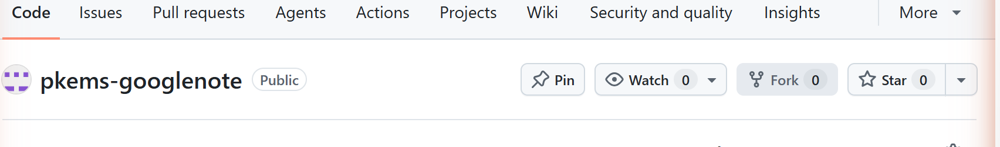

내 계정 아래에 똑같은 저장소가 생깁니다.

### ② Pages 켜기 ← 이걸 안 하면 사이트가 안 열립니다

내 저장소에서 맨 위 탭 중 **`Settings`** (톱니바퀴, 맨 오른쪽) 클릭
→ 왼쪽 메뉴에서 **`Pages`** 클릭

> **보이는 것** — `Build and deployment` 아래 **`Source`** 라는 드롭다운.
> 기본값은 `Deploy from a branch` 입니다.
>
> **누를 것** — 드롭다운을 열어 **`GitHub Actions`** 선택.
> **저장 버튼은 없습니다.** 고르는 즉시 적용됩니다.

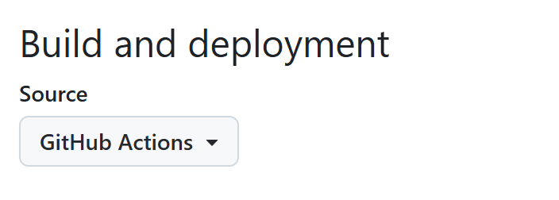

### ③ 배포 확인

맨 위 탭 **`Actions`** → `Deploy to GitHub Pages` 가 돌고 있습니다.
**초록 체크(✅)** 가 뜨면 완료입니다 (1~2분).

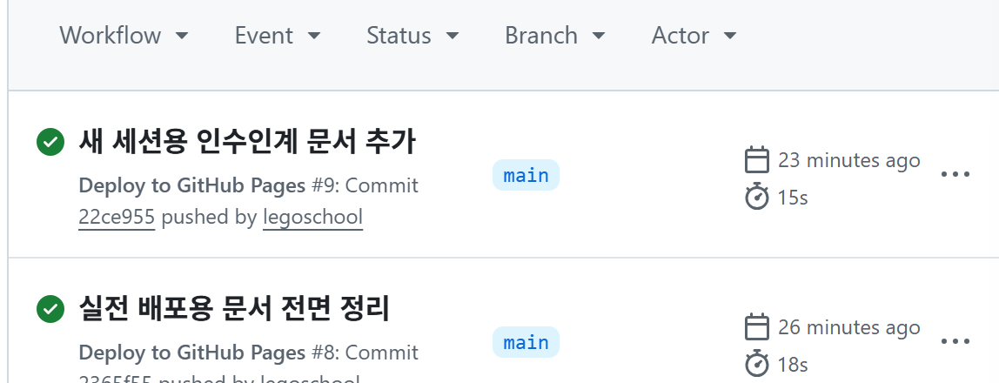

빨간 ✕ 가 뜨면 ②를 안 한 것입니다. ② 하고 Actions에서 **`Re-run all jobs`** 를 누르세요.

### ④ 내 주소 확인

```
배포 주소   https://내계정.github.io/pkems-googlenote/
쓸 값(원본) https://내계정.github.io      ← 뒤쪽 경로를 뺀 앞부분만
```

**「원본」이 뒤에서 계속 쓰입니다.** 헷갈리면, 배포된 앱을 열고
**⚙️ 설정 → 고급** 에 가면 파란 칸에 정확한 원본 주소가 찍혀 있습니다. 그걸 복사하세요.

> GitHub 없이 쓰려면 폴더째 받아서 Netlify 드래그&드롭·학교 웹서버 등에 올려도 됩니다.
> **반드시 `https://` 로 열려야 합니다.** 로그인·캡처·웹캠 모두 `https://` 또는 `localhost` 전용입니다.

---

## B-2. 구글 클라우드 설정 (10분)

[https://console.cloud.google.com/](https://console.cloud.google.com/) 로 갑니다.

### ① 새 프로젝트 만들기

> **보이는 것** — 화면 **맨 위 파란 띠**에 `Google Cloud` 로고 옆으로 현재 프로젝트 이름이
> 드롭다운으로 있습니다.
>
> **누를 것** — 그 프로젝트 이름 클릭 → 오른쪽 위 **`새 프로젝트`**
> → 이름 아무거나(예: `내기록장`) → **`만들기`**

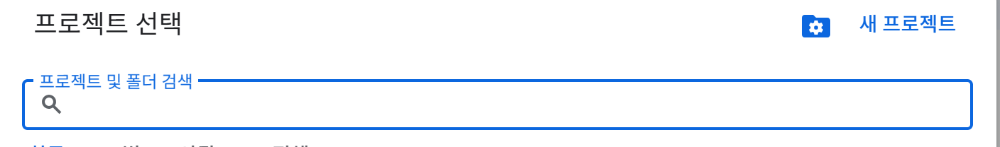

만든 뒤 **그 프로젝트가 선택된 상태인지 반드시 확인**하세요. 다른 프로젝트에 설정하면
나중에 아무리 해도 안 됩니다. 맨 위 띠에 방금 만든 이름이 보여야 합니다.

### ② Google Drive API 켜기

주소창에 바로 넣어도 됩니다 →
`https://console.cloud.google.com/apis/library/drive.googleapis.com`

> **보이는 것** — 드라이브 삼각형 로고와 `Google Drive API` 제목.
> 그 아래 파란 **`사용`** 버튼.
>
> **누를 것** — **`사용`**
> 이미 되어 있으면 초록 체크와 함께 **`✅ API 사용 설정됨`** 이라고 나옵니다. 그럼 넘어가세요.

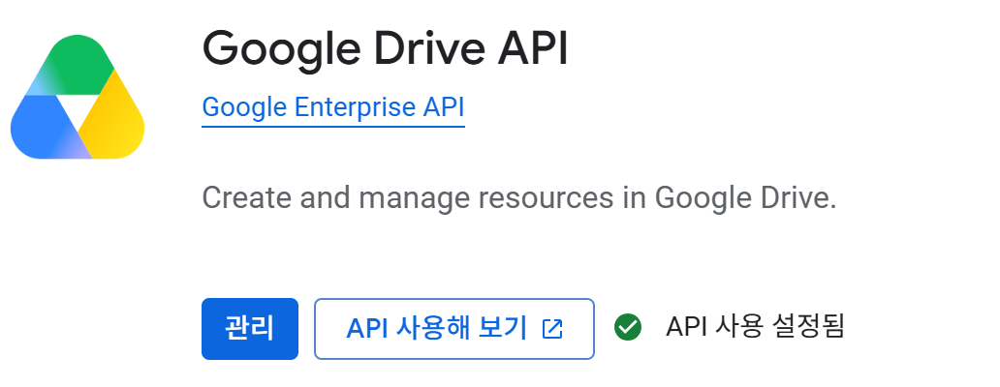

### ③ 브랜딩 — 사용자에게 보일 앱 이름

왼쪽 메뉴 **`Google 인증 플랫폼`** → **`브랜딩`**

| 칸 | 넣을 것 |
|---|---|
| 앱 이름 | **로그인 화면에 그대로 보입니다.** 예: `우리반 기록장` |
| 사용자 지원 이메일 | 본인 이메일 (드롭다운에서 선택) |
| 개발자 연락처 정보 | 본인 이메일 |

→ 맨 아래 **`저장`**

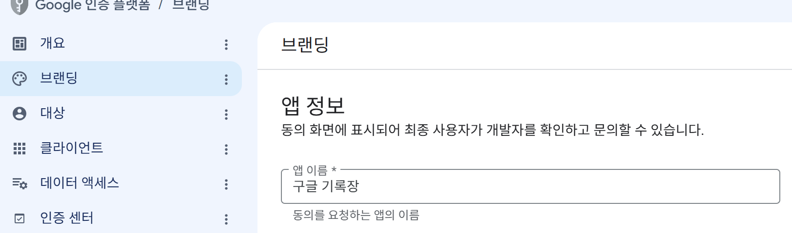

### ④ 대상 — 누가 쓸 수 있는지

왼쪽 메뉴 **`대상`**

> **보이는 것** — `사용자 유형` 항목.
>
> **누를 것** — **`외부`** 선택 → **`만들기`**

만들고 나면 같은 화면에 `게시 상태` 가 **`테스트`** 로 표시됩니다.

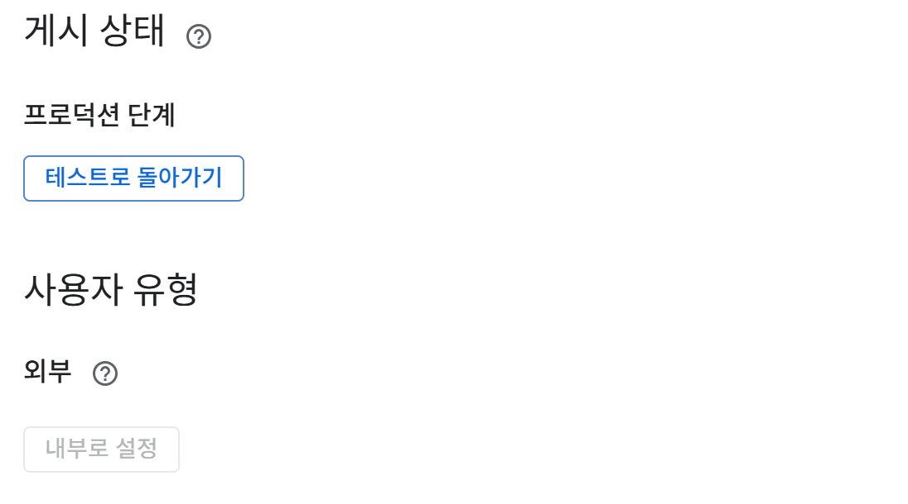

**여기서 선택하세요.**

| | 테스트로 두기 | **프로덕션으로 게시** |
|---|---|---|
| 누가 쓰나 | 테스트 사용자로 **등록한 사람만** | **아무나** |
| 등록 작업 | 쓸 사람마다 이메일 등록 | 없음 |
| 인원 | 목록 100칸 (빼면 자리 남) | 100명 **평생·재설정 불가** |

- **소수(우리 반, 동아리)** → 테스트로 두고 `테스트 사용자` 에 이메일 추가
- **여러 사람에게 링크만 뿌릴 것** → **`앱 게시`** 를 눌러 프로덕션으로
  *(원본 앱이 이 방식입니다)*

### ⑤ 데이터 액세스 — 권한 3개 ⚠️ 가장 많이 막히는 곳

왼쪽 메뉴 **`데이터 액세스`**

> **보이는 것** — 설명문 아래 테두리만 있는 버튼 **`범위 추가 또는 삭제`**.
> 그 아래로 `민감하지 않은 범위` / `민감한 범위` / `제한된 범위` 표 3개가 있고,
> 처음이면 전부 **"표시할 행이 없습니다"** 입니다.
>
> **누를 것** — **`범위 추가 또는 삭제`** → 오른쪽에서 패널이 밀려 나옵니다.

패널 제목은 **`선택한 범위 업데이트`** 입니다.

**⑤-1. 기본 두 개 체크**

표 맨 위쪽에서 아래 두 줄을 찾아 **왼쪽 체크박스**를 켭니다.

```
☑  .../auth/userinfo.email     기본 Google 계정의 이메일 주소 확인
☑  openid                      Google에서 내 개인 정보를 나와 연결
```

(`.../auth/userinfo.profile` 은 **체크하지 마세요.** 안 씁니다.)

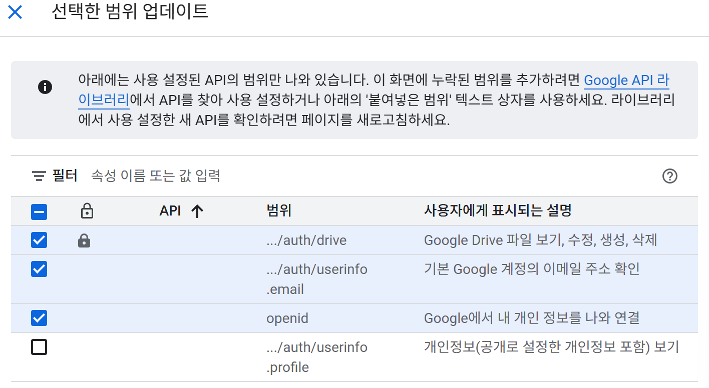

**⑤-2. drive 권한은 직접 넣어야 합니다**

`drive` 는 이 목록에 **안 나옵니다.** 패널을 **맨 아래까지 스크롤**하세요.

> **보이는 것** — **`직접 범위 추가`** 라는 큰 제목과 설명
> ("추가할 범위가 위 표에 표시되지 않으면 여기에 입력할 수 있습니다…"),
> 그 아래 **넓은 입력 상자**, 그 아래 흐린 **`테이블에 추가`** 버튼.
>
> **할 것** — 입력 상자에 아래를 붙여넣습니다.

```
https://www.googleapis.com/auth/drive
```

붙여넣으면 `테이블에 추가` 버튼이 **파랗게 활성화**됩니다 → **누릅니다.**

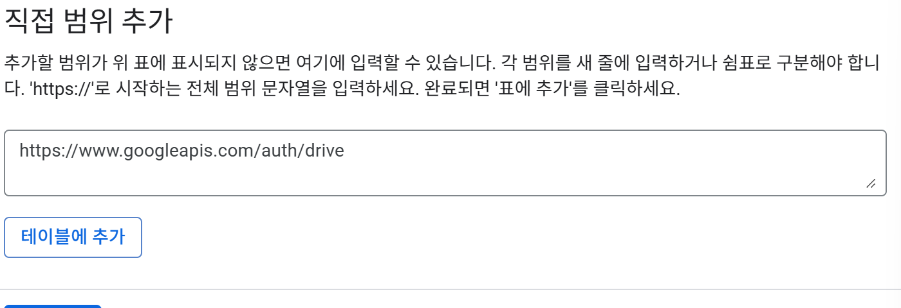

**⑤-3. 들어갔는지 확인**

표 위 **`필터`** 칸에 `drive` 를 쳐 보세요. 이렇게 한 줄이 있어야 합니다.

```
☑  🔒  .../auth/drive     Google Drive 파일 보기, 수정, 생성, 삭제
```

**체크가 켜져 있어야 합니다.** 자물쇠(🔒)는 "제한된 범위"라는 표시로 정상입니다.

저장까지 끝나면 본 화면의 `제한된 범위` 표에 이렇게 들어가 있습니다.

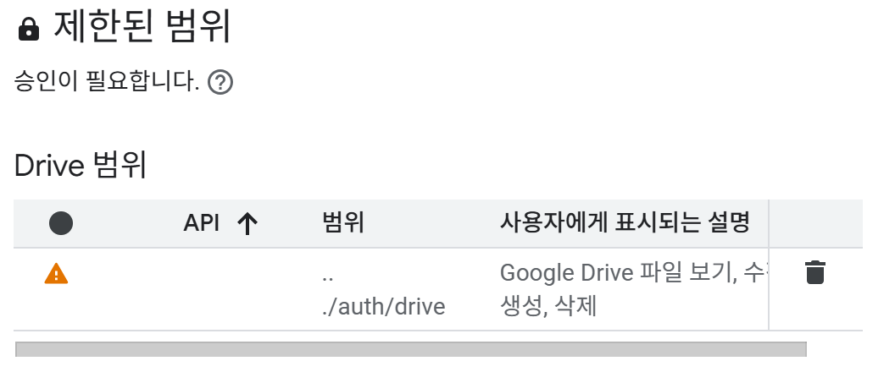

**⑤-4. 저장 — 두 번 눌러야 합니다** ⚠️

1. 패널 맨 아래 파란 **`업데이트`** → 패널이 닫힙니다
2. 이제 본 화면 맨 아래 **`Save`** (또는 `저장`) → **이걸 안 누르면 반영되지 않습니다**

성공하면 화면 아래에 검은 띠로
**"데이터 액세스 변경사항이 저장되었습니다."** 가 뜨고, `Save` 버튼이 **`변경사항이 없음`** 으로 바뀝니다.

저장 후 화면에 이렇게 정리돼 있으면 맞습니다.

```
민감하지 않은 범위    .../auth/userinfo.email
                     openid
민감한 범위          (없음)
제한된 범위          .../auth/drive        ← "승인이 필요합니다" 표시는 정상
```

> `제한된 범위` 아래에 «사용할 기능이 무엇인가요?», «데모 동영상», «YouTube 링크» 같은
> 칸이 나옵니다. 이건 **정식 심사를 신청할 때** 쓰는 것이라 **비워 두세요.**

### ⑥ 클라이언트 만들기 — 주소 등록

왼쪽 메뉴 **`클라이언트`** → **`+ 클라이언트 만들기`**

| 칸 | 넣을 것 |
|---|---|
| 애플리케이션 유형 | **`웹 애플리케이션`** |
| 이름 | 아무거나 (콘솔에서만 보임) |

> **보이는 것** — 아래로 내리면 **`승인된 JavaScript 원본`** 과
> **`승인된 리디렉션 URI`** 두 덩어리가 있습니다.
>
> **할 것** — **`승인된 JavaScript 원본`** 쪽에서 **`+ URI 추가`** 를 누르고,
> B-1 ④에서 적어 둔 **원본**을 넣습니다.

```
https://내계정.github.io
```

- ⚠️ 뒤에 `/pkems-googlenote/` **붙이지 마세요.** 여기서 대부분 틀립니다.
- ⚠️ 끝에 슬래시(`/`) 도 **넣지 마세요.**
- **`승인된 리디렉션 URI`** 는 **비워 둡니다.** 이 앱은 안 씁니다.
- 로컬 테스트도 할 거면 `http://localhost:8000` 을 한 줄 더 추가하세요.

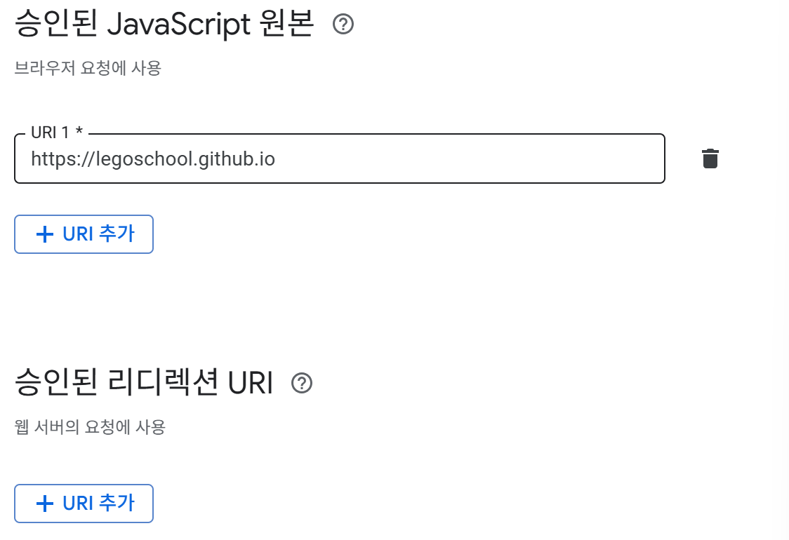

→ **`만들기`**

> **보이는 것** — 팝업에 **클라이언트 ID** (`숫자-문자열.apps.googleusercontent.com`) 와
> **클라이언트 보안 비밀번호** 가 함께 나옵니다.
>
> **할 것** — **클라이언트 ID만** 복사하세요.
> **보안 비밀번호는 이 앱에서 쓰지 않습니다. 저장소에 절대 넣지 마세요.**

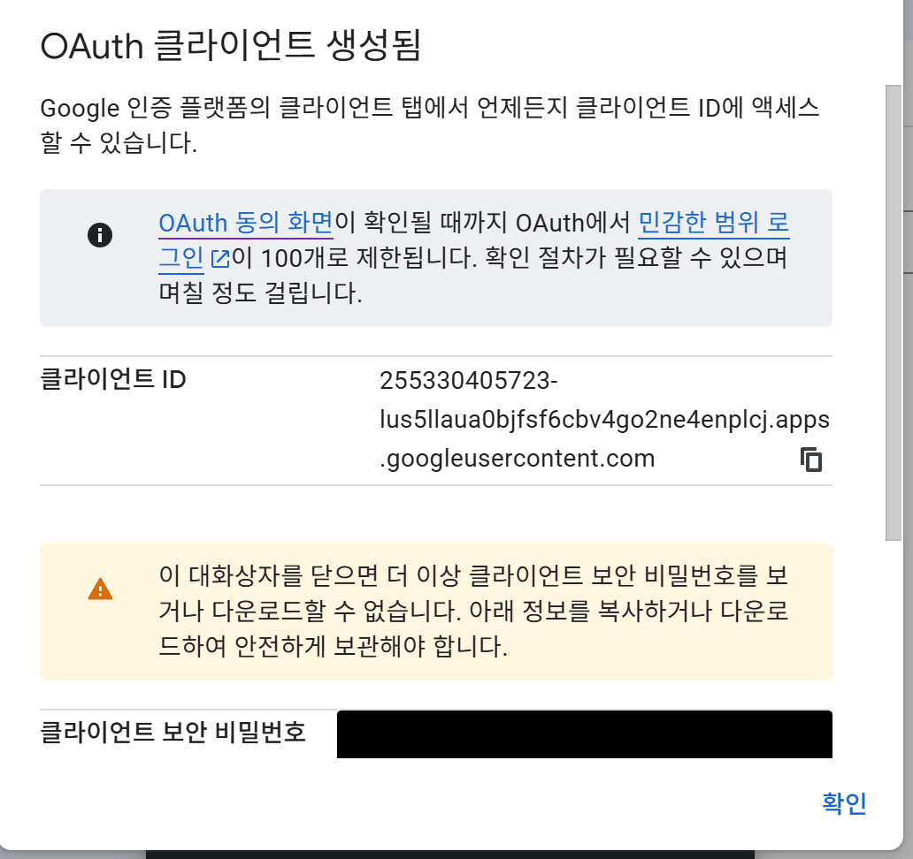

클라이언트 ID는 비밀번호가 아니라 공개용 식별자라, 코드에 들어가도 안전합니다.

---

## B-3. 코드에 내 클라이언트 ID 심기 ⚠️ 안 하면 로그인 안 됩니다

내 GitHub 저장소에서 **`index.html`** 클릭 → 오른쪽 위 **연필(✏️) 아이콘** (Edit this file)

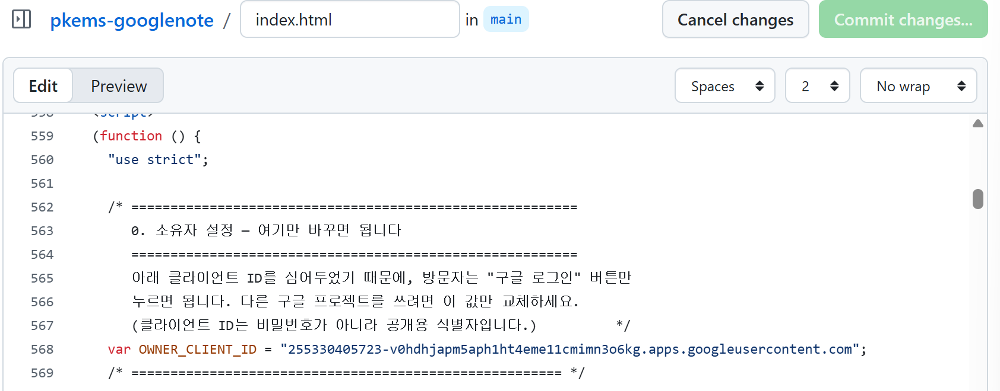

`Ctrl+F` 로 `OWNER_CLIENT_ID` 를 찾으면 이 줄이 나옵니다.

```js
var OWNER_CLIENT_ID = "255330405723-v0hdhjapm5aph1ht4eme11cmimn3o6kg.apps.googleusercontent.com";
```

**따옴표 안만** 방금 복사한 내 클라이언트 ID로 바꿉니다.

```js
var OWNER_CLIENT_ID = "내숫자-내문자열.apps.googleusercontent.com";
```

→ 오른쪽 위 **`Commit changes...`** → **`Commit changes`**

푸시되면 Actions 가 자동으로 다시 배포합니다 (1~2분).

> **왜 꼭 바꿔야 하나** — 원본에 적힌 ID는 `https://legoschool.github.io` 에서만
> 동작하도록 묶여 있습니다. 안 바꾸면 내 주소에서는 **로그인 창이 떴다가 즉시 닫힙니다.**
>
> 코드를 못 고치겠으면 앱의 **⚙️ 설정 → 고급 → 구글 OAuth 클라이언트 ID** 에 붙여넣어도
> 되지만, 그건 **그 브라우저에만** 저장됩니다. 남에게 나눠 줄 거면 반드시 코드에 심으세요.

---

## B-4. 첫 로그인 — 이 화면이 나오면 정상입니다

배포 주소를 열고 **[구글 로그인]** 을 누릅니다.

**계정 선택** 화면 다음에 이런 화면이 나옵니다.

```
┌──────────────────────────────────────────────┐
│  Google에서 아직 인증하지 않은 앱으로,        │
│  금방 중단될 수 있습니다.                     │
│                                              │
│  (앱이름)에서 내 Google 계정에 액세스하려고    │
│  합니다                                       │
│      my@gmail.com                            │
│                                              │
│  ☑ Google Drive 파일 보기, 수정, 생성, 삭제   │
│  ☑ 기본 Google 계정의 이메일 주소 확인        │
│  ☑ Google에서 내 개인 정보를 나와 연결        │
│                                              │
│              [ 거부 ]  [ 허용 ]               │
└──────────────────────────────────────────────┘
```

**이 경고는 정상입니다.** 개인·학교가 만든 앱은 전부 이 화면이 나옵니다.
계정 선택 단계에서 **[고급]** → **[(앱이름)(으)로 이동]** 이 먼저 나오는 경우도 있는데,
같은 뜻입니다. 통과하고 **[허용]** 을 누르세요.

권한 세 줄이 **위와 똑같이** 보이면 B-2 ⑤를 제대로 한 것입니다.
`Google Drive` 줄이 **없으면** ⑤-4의 **`Save`** 를 안 누른 것입니다.

이어서 **⚙️ 설정 → 저장할 구글 드라이브 폴더** 에 폴더 링크를 붙여넣고
**[이 폴더로 연결]** → 아무거나 하나 써서 저장 →
드라이브 폴더에 `.md` 가 생기면 **완료**입니다.

---

## B-5. 마무리 — 웹 클리퍼 다시 설치

**웹 클리퍼를 쓸 거라면** 작성 화면의 **`🌐 웹에서 가져오기`** (`＋ 링크` 옆) 를 열어
**새 주소로 다시 설치**하세요.
북마클릿에는 앱 주소가 박혀 있어서, 원본 주소로 만든 것은 내 배포본으로 열리지 않습니다.

---

## 막혔을 때

| 증상 | 원인과 해결 |
|---|---|
| 로그인 창이 떴다가 바로 닫힘 | 승인된 자바스크립트 원본이 안 맞습니다. 경로 빼고 `https://계정.github.io` 만. 사본이면 **B-3(클라이언트 ID 교체)** 을 빠뜨렸을 가능성이 큽니다 |
| "확인되지 않은 앱" 경고 | 정상입니다. **고급 → 이동** 으로 통과 |
| `403 access_denied` / "앱이 차단됨" | 100명 한도가 찼거나, 앱이 테스트 상태인데 등록 안 된 계정입니다 |
| 로그인은 되는데 폴더 확인 실패 | `.../auth/drive` 범위가 빠졌거나 마지막 **[저장]** 을 안 눌렀습니다. 추가 후 [계정 권한](https://myaccount.google.com/permissions)에서 연결을 끊고 다시 로그인 |
| "폴더가 아닙니다" | 파일 링크를 넣었습니다. 폴더를 연 상태의 주소여야 합니다 |
| 화면 캡처·웹캠이 안 됨 | `https://` 또는 `localhost` 에서만 됩니다. `file://` 로 연 파일은 브라우저가 막습니다 |
| 휴대폰에 화면 캡처가 없음 | 정상입니다. 스크린샷을 찍고 **갤러리에서 고르기** 로 넣으면 PC와 같은 결과 |
| 큰 영상이 안 올라감 | 200MB 초과입니다. 유튜브 «일부공개» + `＋ 코드 삽입` 을 쓰세요 |
| 옵시디언에서 만든 노트가 앱에 없음 | `설정 → 저장 위치 → 📥 폴더 훑어서 가져오기` |

---

## 코드를 고친 뒤 배포하기

```bash
git add -A && git commit -m "설명" && git push
```

푸시하면 GitHub Actions 가 자동 배포합니다. 1~2분 뒤 반영됩니다.
진행 상황은 저장소의 **Actions** 탭에서 볼 수 있습니다.

---

## 나중에 인원 제한을 완전히 풀려면

`.../auth/drive` 대신 **`drive.file`(앱이 만든 파일만)** 로 낮추면
**심사도 인원 제한도 없어집니다.** 대신 폴더를 링크로 지정하는 대신
**구글 폴더 선택창(Picker)에서 클릭**해 고르게 됩니다 — 사용자에겐 오히려 더 쉽습니다.

바꾸려면 구글 콘솔에서 **Picker API 사용 설정 + API 키 1개 발급**이 추가로 필요하고,
앱의 폴더 지정 부분을 Picker 로 교체해야 합니다.
🅐/🅑 로 부족해지면 그때 검토하세요.
